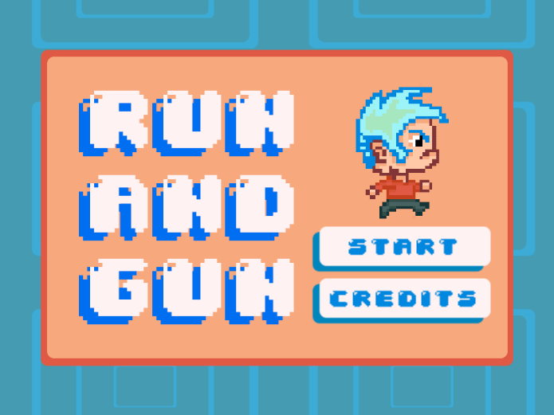
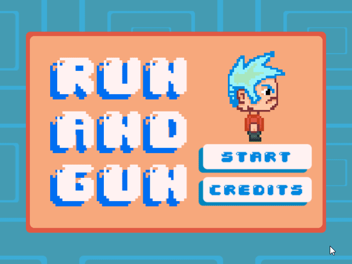

# How to code an action game using PhaserJS

Winning Action Game made for [Mintbean](https://www.mintbean.io)'s Hackathon challenge.



link to deploy [HERE](https://run-and-gun.netlify.app/)

## This game uses
- PhaserJS
- Bootstrap
- Netlify

## Info 

Run and Gun is a fast paced infinite runner platformer. Make your way acrros the infinite world while avoiding falling into the river or getting shot by an enemy. See how far you can last and how many baddies you can shoot along the way.



## Controls

#### Arrow Keys
for moving and jumping

#### Left Mouse Button
for shooting

## Getting started

You can get started with the following commands.

```bash
npm install
npm start
```

## FAQ: What is PhaserJS?

PhaserJS is a desktop and mobile JavaScript game framework. It's built on top of Canvas
and WebGL. It features preloading, physics, sprites, animations, particles, sound,
tilemaps, a plugin system, mobile browser support, and more.

## FAQ: Why should I learn game development?

Video games make for excellent portfolio pieces. Making a video game lets you
prove your talent for coding and and your ability to solve real-world problems.
Candidates that have video games on their portfolios end up attracting lots of
attention from potential recruiters and hiring managers.

The ability to build a video game is also one of the most satisfying parts of being a
software developer. Being able to interact with a world you've built can create a
passion for coding and genuine interest in software development.

## FAQ: Should I use React? Can I use create-react-app?

I would not recommend mixing React and PhaserJS. They have very different ways
of working, and it can be difficult to get the two working well together.

You might be considering using React, Vue, or another web framework. Building an
action game can be difficult with just React because React doesn't support collision
detection or keyboard shortcuts out of the box.

I would recommend sticking to PhaserJS for this hackathon.

## FAQ: What is this "Parcel" thing? What the heck is a bundler?

If you're coding in JavaScript, you might know what bundlers are and how they work.
Some names of bundlers you may have heard of are [Webpack](https://webpack.js.org/),
[Parcel](https://parceljs.org/) and [Rollup](https://rollupjs.org/guide/en/). They
stitch together your application logic and your `node_modules` folder so that
your application can be deployed and to the web. Before bundlers, developers had
to manually ensure their JavaScript files worked well with each other. If you're
used to using `create-react-app`, Gatsby or Next.js, then you may have already
used a bundler without realizing it. (They all use Webpack under the hood.)

For this tutorial, we're going to use Parcel. Parcel is the easiest bundler out
there, featuring an easy installation and getting-started process.

## FAQ: How do I deploy?

Mintbean is about exploring the unknown. Check out Phaser's documentation for
instructions on how to build this project. If you need help, ask the community on
Discord. The best place to ask is #code-mentor-help.
